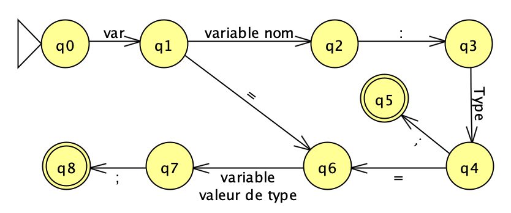
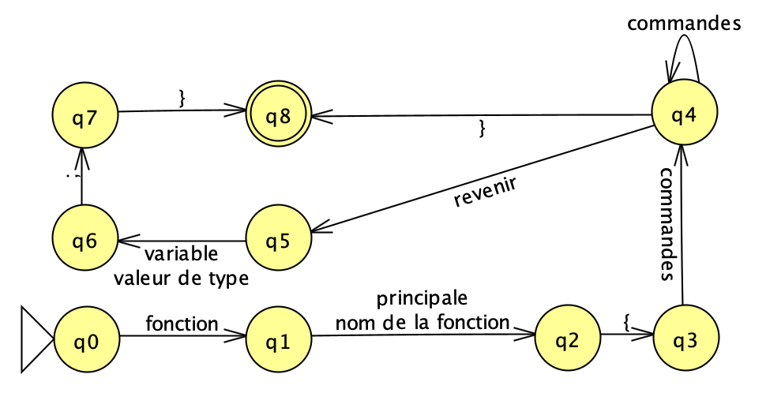
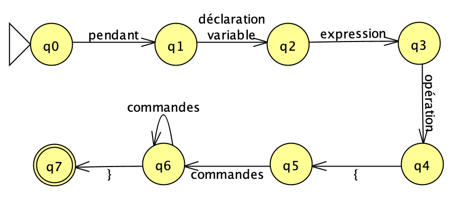
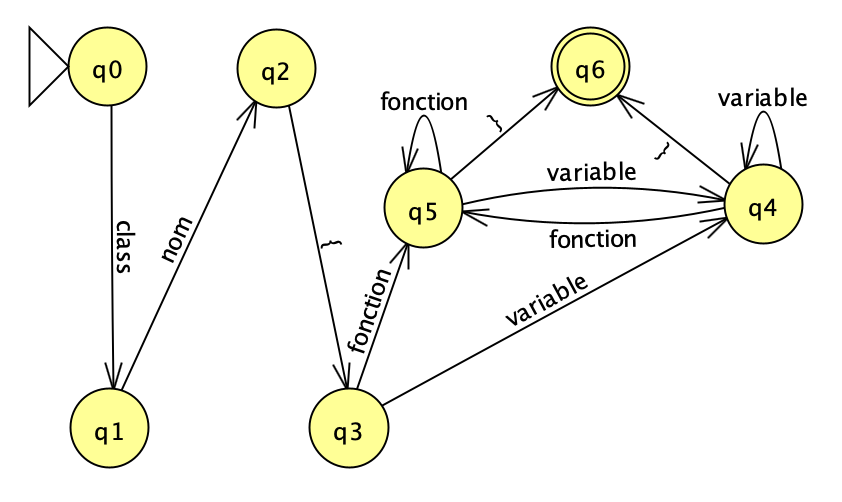

# GNBS Language Compiler

This project will be a C++/Golang compiler using the French language.
It's going to follow the strong typed iterative paradigm.

## Syntax

### Types

- Entier (Ent) -> *Integer*
- Flottant (Flot) -> *Float*
- Chaîne (Cha) -> *String*

### Reserved Words
- **Types**
    - **Ent**
    - **Flot**
    - **Cha**
- **If & Else**
    - **si**
    - **sinon si**
    - **autre**
- **Logic & Arithmetic**
    - **et**
    - **ou**
    - **np**
    - **mod**
  
- **General**
    - **var**
    - **fonction** 
    - **classe**
    - **revenir**
    - **pendant**


### Declaring a variable

There are several ways to declare a variable in the GNBS language. We are going to go through all the ways to declare a integer.

```
var x: Ent
var x = 10
x := 10
```

### Operations

#### If & Else

```
si 'expression' {}
sinon si 'expression' {}
autre {}
```

#### Logic Operators

```
et -> (and | &&)
ou -> (or | ||)
np -> (not | !)
```

#### Arithmetic Operators

```
+
-
*
/
mod
```

### For Loop
```
pendant i := 0;  i < 10; i++ {}
pendant i := 10; i > 0;  i-- {}
```

### Creating a Class
```
classe nom {
    nom: Type                               // variable
    nom(paramètre: Type) -> revenirType {  // fonction
        // Corps de la fonction
    }
}
```

###  Creating a Function
```
fonction nom(paramètre: Type) -> revenirType {
    // Corps de la fonction
    revenir objet
}
```

## Automaton

### Declaring a variable



### Creating a fonction



### Pendant Loop



### Creating a class


